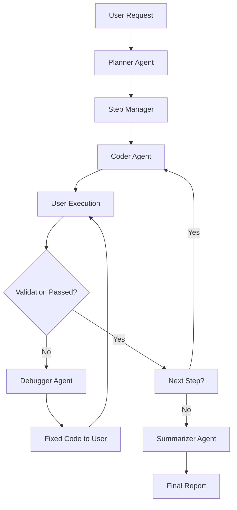

# Multi-Agent Orchestration System

A LangGraph-based multi-agent system that decomposes complex user requests into executable steps, generates code, handles debugging, and produces concise reports.

## Features

- **Planner Agent**: Breaks down natural language requests into atomic steps
- **Step Manager**: Orchestrates workflow execution and validation
- **Coder Agent**: Generates executable code for each step
- **Debugger Agent**: Fixes code when errors occur
- **Summarizer Agent**: Produces final reports after all steps complete

## System Architecture



## Installation

1. Clone this repository
2. Install dependencies:
   ```bash
   pip install -r requirements.txt
   ```

## Usage

```python
from main import MultiAgentOrchestrator

# Initialize the orchestrator
orchestrator = MultiAgentOrchestrator()

# Execute a request
result = orchestrator.execute_request("scan my local network for Android devices")
print(result)
```

## Hosted Backend

The backend of this system is hosted on AWS and can be accessed at:

[http://13.53.125.55](http://13.53.125.55)

You can also connect to the WebSocket endpoint using:

```bash
wscat -c ws://13.53.125.55/ws
```


## Safety Features

- Never auto-executes system or network code
- Only generates code for user to run manually
- Validates every step before moving forward
- Never skips debugging if errors occur

## Example

For the request "scan my local network for Android devices", the system:
1. Identifies the local network range
2. Scans for active hosts
3. Identifies Android devices
4. Generates a comprehensive report
